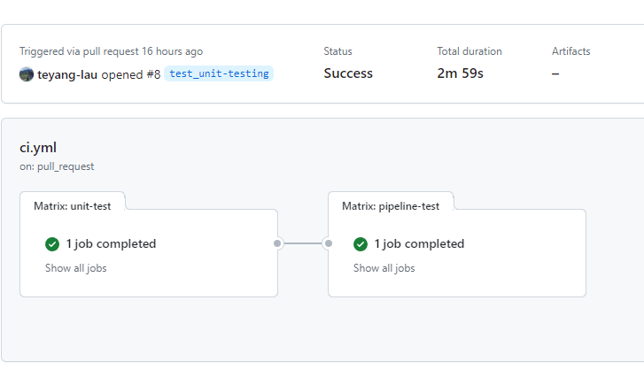

# <div align="center">End-to-end MLOps Using MLflow</div>

<div align="center">

[](https://www.python.org/)
[](https://mlflow.org/)
[](https://github.com/features/actions)
[](http://commonmark.org) <br>
[](https://shields.io/)
[](https://github.com/teyang-lau/YOListenO/blob/main/LICENSE)
<br><br><br>

</div>

<p align="center">
  
  <br><br>

## About

* Developing and implementing a MLOps pipeline for a ML problem, leveraging the capabilities of MLflow

    * Robust automated workflow that covers the entire ML lifecycle, including data validation, processing, model training, evaluation, validation and deployment

    * Monitoring and logging functionalities within the pipeline along with a ML metadata store to provide insights into model performance and ensure data lineage and reproducibility
</p>

<br>

## How to run
1. Create a new branch
    ```
    git checkout -b new_branch
    ```
2. Modify pipeline code as necessary 
3. Create experiment and start a run or multiple runs with parameters
    ```
    mlflow experiments create -n experiment_name # create a new experiment
    mlflow run --experiment-name experiment_name -P eval_mae_threshold=150000 .
    ```
4. Commit code
    ```
    git add .
    git commit -m "<changes to code & pipeline>"
    git push origin new_branch
    ```
5. Create pull request on GitHub, which will automatically trigger a CI workflow consisting of:
    - Unit testing of code 
    - Testing of pipeline 

    
6. Deploy model to staging/production in local REST server
    ```
    python scripts/model_transition.py --modelname <modelname> --version <version> --stage <stage>
    # eg below will transition model version 1 to Staging and deploy it to local REST server 

    python scripts/model_deploy.py --modelname random_forest_regressor_HDB_Resale_Price --version=1 --stage Staging
    ```
7. Inference (open another terminal)
    ```
    curl http://127.0.0.1:1234/invocations -H 'Content-Type: application/json' -d '{
      "dataframe_split": {
      "columns": ["flat_type", "storey_range", "floor_area_sqm", "lease_commence_date", "remaining_lease", "BEDOK", "BISHAN", "BUKIT BATOK", "BUKIT MERAH", "BUKIT PANJANG", "BUKIT TIMAH", "CENTRAL AREA", "CHOA CHU KANG", "CLEMENTI", "GEYLANG", "HOUGANG", "JURONG EAST", "JURONG WEST", "KALLANG/WHAMPOA", "MARINE PARADE", "PASIR RIS", "PUNGGOL", "QUEENSTOWN", "SEMBAWANG", "SENGKANG", "SERANGOON", "TAMPINES", "TOA PAYOH", "WOODLANDS", "YISHUN", "Apartment", "DBSS", "Improved", "Maisonette", "Model A", "Model A2", "Multi Generation", "New Generation", "Premium Apartment", "Premium Apartment Loft", "Simplified", "Standard", "Type S1", "Type S2"],
      "data": [[3,1,104.0,1986,63,0.0,1.0,0.0,0.0,0.0,0.0,0.0,0.0,0.0,0.0,0.0,0.0,0.0,0.0,0.0,0.0,0.0,0.0,0.0,0.0,0.0,0.0,0.0,0.0,0.0,0.0,0.0,0.0,0.0,1.0,0.0,0.0,0.0,0.0,0.0,0.0,0.0,0.0,0.0]]
      }
    }'
    ```


<br>

## To Do
- [ ] Jensen Shannon divergence for data drift
- [ ] Hyperparameter tuning
- [ ] Log immediate parent run
- [ ] Pass multiple params into subsequent runs down the pipeline
- [ ] Get mlflow logs written in log file
- [ ] Using caching for runs that were ran before. Still does not work for dependant runs. For eg., if data in preprocess changes, only preprocess run will run, while training will not, since train script is not modified
- [ ] Try to keep track of whether a run was modified before. If so, all subsequent runs will have to run! (maybe have a var to keep track if previous runs were ran. If so, all subsequent children runs must run again)
- [x] Data & Model Validation
- [x] Try moving all scripts to scripts folder and make it work
- [x] Create experiments name for the pipeline

<br>

## Logs
* 14 Jun — implemented model_deploy.py for transitioning model and deploying to staging and production
* 13 Jun — implemented CI (unit test & pipeline test) using GitHub actions.
* 12 Jun — data_validate.py works. It compares against previous schema from the latest successful run, if any, and logs current schema. Also validates for missing data and stops the run if any are found. Improved logging and formatting. Implemented unit tests for utils.py
* 9 Jun — logged all `run_id`s in main.py and created function to infer basic schema of pandas dataframe for data validation. Wrote prelim schema checks that will check for data types and range of values for numeric columns and domain values for object columns 
* 8 Jun — evaluation.py and model_validate.py works. Also integrated SHAP model explanability check into model validation step, which will log the shap plots and the explainer
* 7 Jun — Got MLproject pipeline with just preprocess step working. Can just run `mlflow run .` in directory. Created hash checking to make the run runs if code changes. train.py works for taking data from previous step and training and validating model
* 6 Jun — preprocess.py works to preprocess and split data into train, val, test. Logged category features schema and data artifacts using mlflow. Saved python logs to log file


